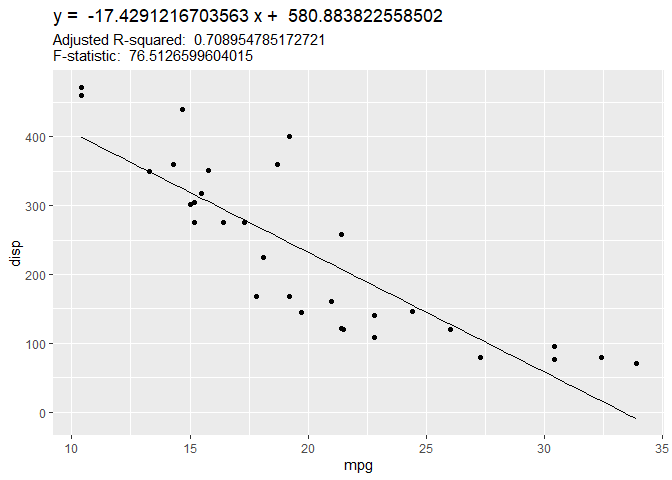

<!-- README.md is generated from README.Rmd. Please edit that file -->

# quickGraph

<!-- badges: start -->
<!-- badges: end -->

The goal of quickGraph is to create a functions that helps researchers
quickly fit a model on a data set and visualize the data alongside the
model. Additionally the plot will provide basic statistics including the
model function, F-statistic and adjusted R-square. Currently, the
quickGraph library only has one function, plotLinearModel, which fits
and visualize simple linear model.

## Installation

quickGraph is not yet on CRAN. It can be downloaded from this repository
using the following R command:

``` r
devtools::install_github("Glenn032787/quickGraph")
```

## Usage

This is basic usage of the function of plotLinearModel.

    USAGE: plotLinearModel(data, x, y)

The output is a ggplot object with data points from column x and y in
data and a line representing the simple linear model that is fitted from
of those data. The title of the ggplot object is the simple linear
function and the subtitle is the adjusted R-squared value and
F-statistic of the linear model. The data in the x and y columns in data
must be numeric. Rows containing NA in column x and y are not included
in model fitting and in plot. Data should have at least 3 numeric rows
so that the linear model can be calculated. Note that the data set must
be a tibble rather than a data frame. Also note that the column names
for x and y should be character data type (inside quotation).

## Example

This is a basic example which shows you how to fit a simple linear model
onto the mpg and disp column in mtcars data set. This allows for
researchers to quickly visualize the relationship between mpg and disp
in mtcars data set.

``` r
library(quickGraph)

mt_car.tb <- tibble::as_tibble(mtcars)

plotLinearModel(mt_car.tb, "mpg", "disp")
```


